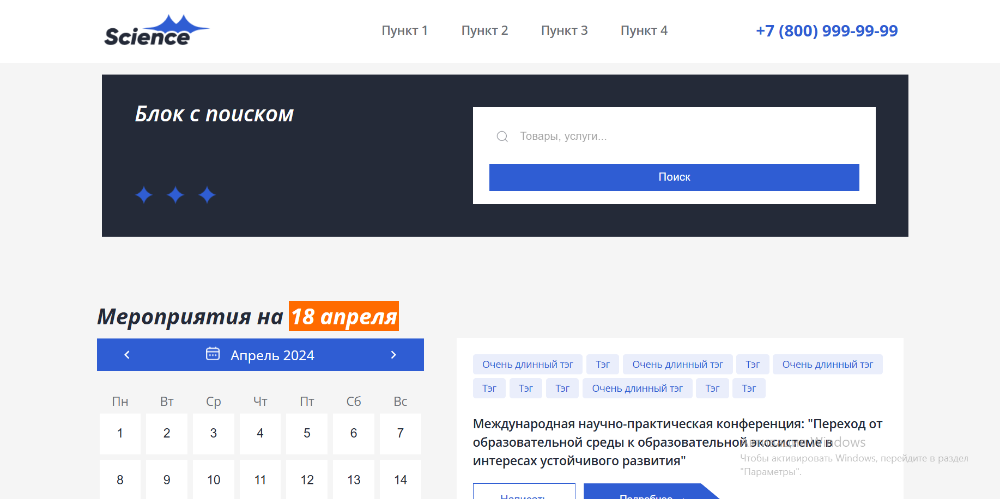
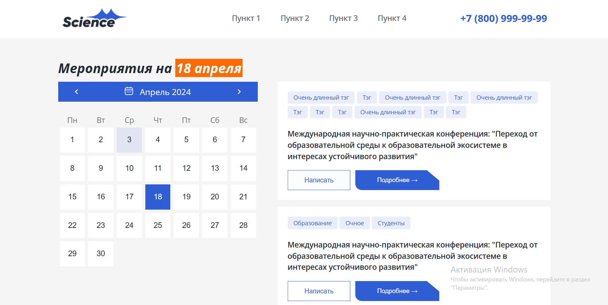
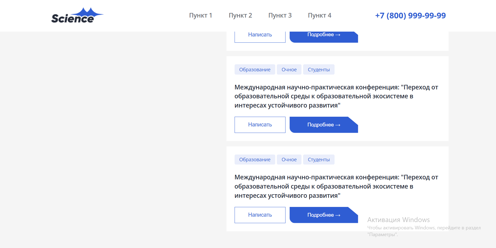
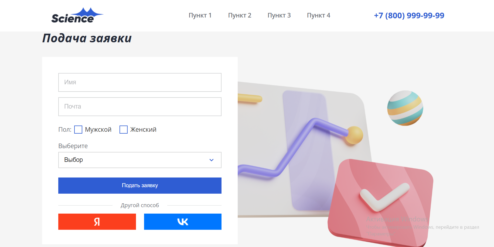
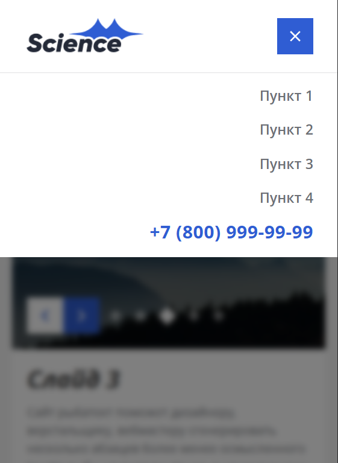
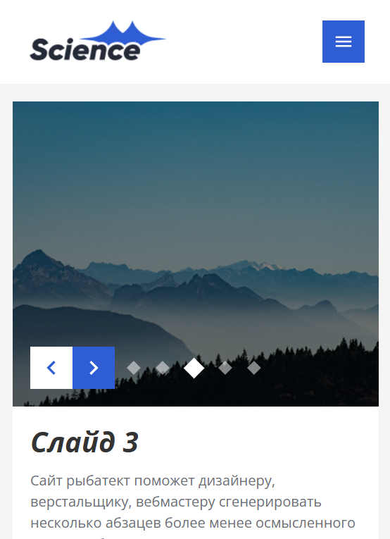
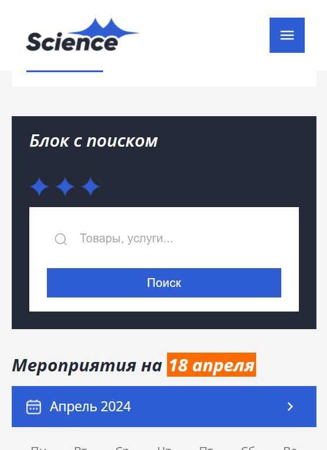
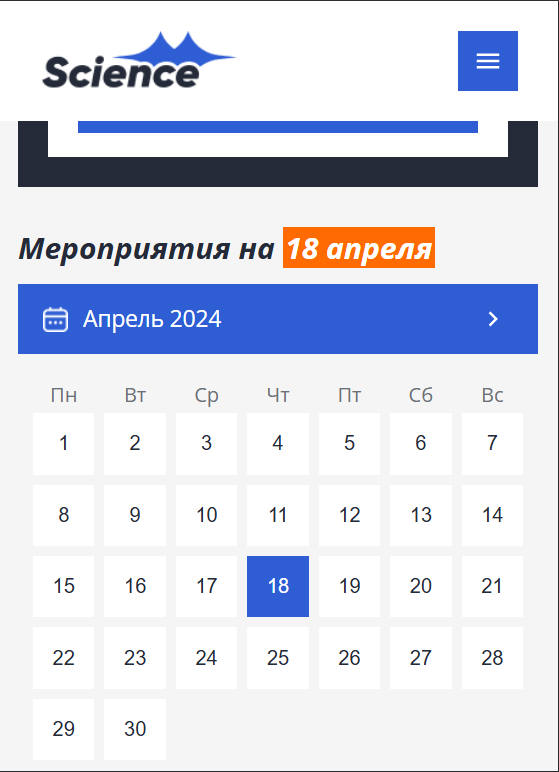
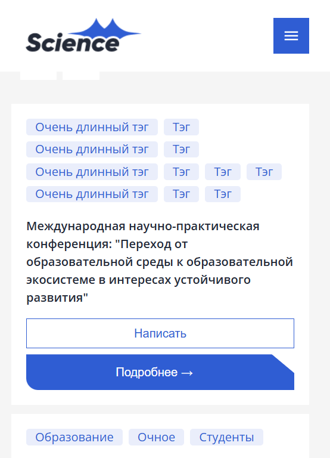
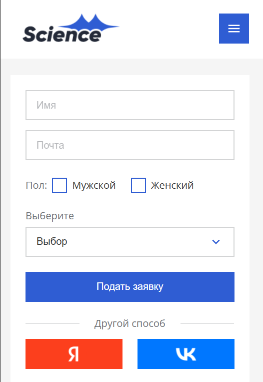

# Test task

## Table of contents

- [Overview](#overview)
  - [Screenshot](#screenshot)
  - [Links](#links)
- [My process](#my-process)
  - [Built with](#built-with)
- [Author](#author)

## Overview

### Screenshot

Desktop version:  

Mobile version:  

### Links

- Live Site URL: [test-feb](https://minleya.github.io/test-feb/)

## My process

### Built with

- React
- Typescript
- SCSS
- Semantic HTML5
- Material UI
- Vite
- Mobile-first overflow

## Author

- GitHub - [minLeya](https://github.com/minLeya)